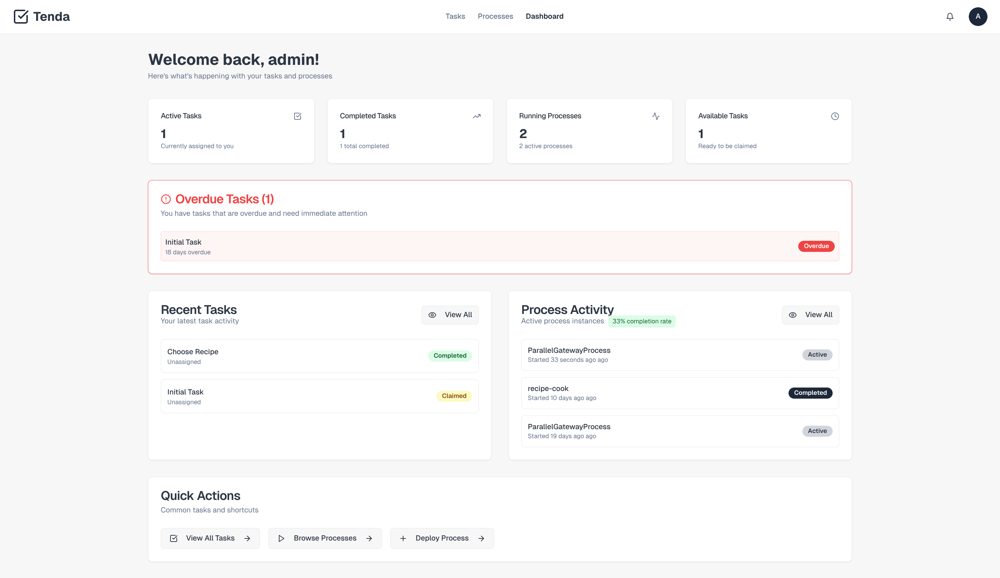

# Tenda 

A modern web application for business process management (BPM) and workflow automation. This app provides a comprehensive interface for managing tasks and processes, integrated with the Abada engine backend.



## 🚀 Features

### Task Management
- **Task Dashboard**: View and manage assigned tasks with filtering and search capabilities
- **Task Status Tracking**: Support for AVAILABLE, CLAIMED, COMPLETED, and FAILED statuses
- **Task Operations**: Claim, complete, and fail tasks with variable support
- **Task Details**: Detailed view of individual tasks with process context

### Process Management
- **Process Definitions**: Browse available BPMN process definitions
- **Process Visualization**: Interactive BPMN diagram viewer using bpmn-js
- **Process Deployment**: Upload and deploy new BPMN process files
- **Process Instances**: Start new process instances with custom variables
- **Process Monitoring**: Track running process instances

### Authentication & Authorization
- **User Authentication**: Login system with JWT token management
- **Role-based Access**: Support for user groups and permissions
- **Session Management**: Persistent authentication with localStorage
- **Protected Routes**: Route-level authentication guards

### User Interface
- **Modern Design**: Clean, professional interface with dark/light theme support
- **Responsive Layout**: Mobile-friendly design with responsive navigation
- **Interactive Components**: Rich UI components including dialogs, dropdowns, and forms
- **Real-time Feedback**: Toast notifications and loading states

## 🛠️ Technology Stack

- **Frontend Framework**: React 18 with TypeScript
- **Build Tool**: Vite
- **UI Library**: shadcn/ui components built on Radix UI primitives
- **Styling**: Tailwind CSS with custom theming
- **State Management**: React Query (TanStack Query) for server state
- **Routing**: React Router DOM
- **BPMN Visualization**: bpmn-js library for process diagram rendering
- **Forms**: React Hook Form with Zod validation
- **Icons**: Lucide React

## 📁 Project Structure

```
src/
├── components/          # Reusable UI components
│   ├── ui/             # shadcn/ui component library
│   ├── AuthProvider.tsx # Authentication context
│   ├── Layout.tsx      # Main application layout
│   └── BpmnViewer.tsx  # BPMN diagram viewer
├── pages/              # Route components
│   ├── Tasks.tsx       # Task management page
│   ├── Processes.tsx   # Process management page
│   ├── TaskDetail.tsx  # Individual task view
│   └── ProcessDetail.tsx # Process definition view
├── hooks/              # Custom React hooks
├── lib/                # Utility libraries
│   ├── api.ts          # API client and types
│   ├── auth.ts         # Authentication utilities
│   └── utils.ts        # General utilities
└── main.tsx           # Application entry point
```

## 🚀 Getting Started

### Prerequisites

- Node.js (v18 or higher) - [install with nvm](https://github.com/nvm-sh/nvm#installing-and-updating)
- npm or bun package manager

### Installation

1. **Clone the repository**
   ```bash
   git clone <YOUR_GIT_URL>
   cd tenda-orun-dashboard
   ```

2. **Install dependencies**
   ```bash
   npm install
   # or
   bun install
   ```

3. **Start the development server**
   ```bash
   npm run dev
   # or
   bun dev
   ```

4. **Open your browser**
   Navigate to `http://localhost:5173` to view the application.

### Available Scripts

- `npm run dev` - Start development server
- `npm run build` - Build for production
- `npm run build:dev` - Build for development
- `npm run preview` - Preview production build
- `npm run lint` - Run ESLint

## 🔧 Configuration

### API Configuration

The application connects to a backend API. Update the API base URL in `src/lib/api.ts`:

```typescript
const API_BASE_URL = 'http://localhost:5601/abada/api';
```

### Authentication

The application uses JWT-based authentication. Update the test user configuration in `src/lib/auth.ts`:

```typescript
export const TEST_USER = 'test-user';
export const TEST_GROUPS = 'customers';
```

## 🎯 Use Cases

This dashboard is designed for:

- **Business Process Management**: Organizations needing to manage complex workflows
- **Task Assignment**: Teams requiring task distribution and tracking
- **Process Automation**: Companies implementing BPMN-based process automation
- **Workflow Monitoring**: Real-time visibility into business process execution

## 🔗 API Integration

The application integrates with a REST API providing:

- **Task Management**: CRUD operations for tasks
- **Process Management**: Process definition and instance management
- **Authentication**: JWT-based user authentication
- **File Upload**: BPMN process deployment

## 🚀 Deployment

### Development Deployment

   ```bash
   npm run dev
   ```

### Production Deployment

1. Build the application:
   ```bash
   npm run build
   ```

2. Deploy the `dist` folder to your preferred hosting service


## 🤝 Contributing

1. Fork the repository
2. Create a feature branch (`git checkout -b feature/amazing-feature`)
3. Commit your changes (`git commit -m 'Add some amazing feature'`)
4. Push to the branch (`git push origin feature/amazing-feature`)
5. Open a Pull Request

## 📄 License

MIT

## 🆘 Support

For support and questions, please contact the development team or create an issue in the repository.
